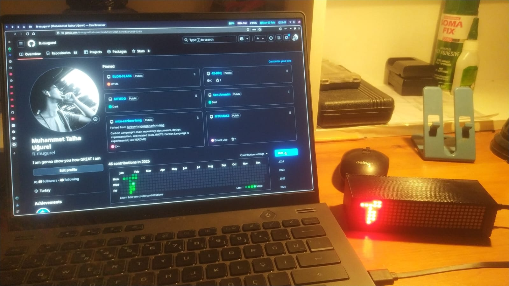

# ESP8266 GitHub Contributions Display

 <!-- Replace with your actual image path -->

This project uses an ESP8266 microcontroller to connect to the GitHub API, fetch your GitHub contribution data, and display it on a screen. It’s a fun and interactive way to visualize your coding activity in real-time!

## Table of Contents
- [Introduction](#introduction)
- [Features](#features)
- [Hardware Requirements](#hardware-requirements)
- [Software Requirements](#software-requirements)
- [Setup Instructions](#setup-instructions)
- [Configuration](#configuration)
- [How It Works](#how-it-works)
- [Contributing](#contributing)
- [License](#license)

## Introduction
This project demonstrates how to use an ESP8266 to interact with the GitHub API and retrieve your contribution data. The data is then displayed on a screen, making it a great desktop gadget for developers who want to keep track of their GitHub activity.

## Features
- Fetches GitHub contribution data using the GitHub API.
- Displays contributions on a screen (e.g., OLED, LCD, or TFT).
- Lightweight and easy to set up.
- Customizable for different GitHub usernames and display formats.

## Hardware Requirements
- ESP8266 (e.g., NodeMCU)
- Display screen (e.g., 8x8x4 matrix display)
- Breadboard and jumper wires (if needed)
- Micro-USB cable for power and programming

## Software Requirements
- Arduino IDE
- ESP8266 board support package
